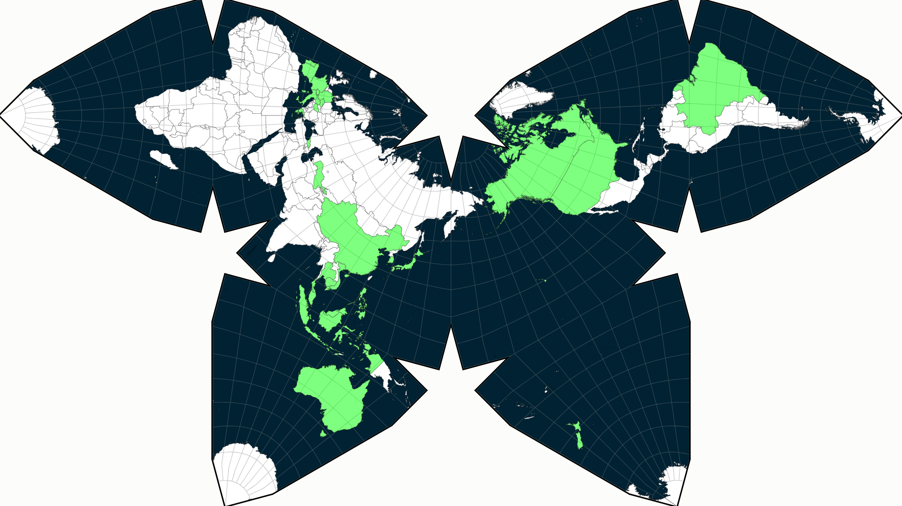

# Waterman Butterfly Projection Visited Countries Visualizer

## Usage

1. Install `geopandas`.
2. Modify your visited country list in `save_as_geojson.py` as appropriate.
3. Run `python save_as_geojson.py`.
4. Start HTTP server via `python -m http.server 8080`.
5. See result at `localhost:8080`.